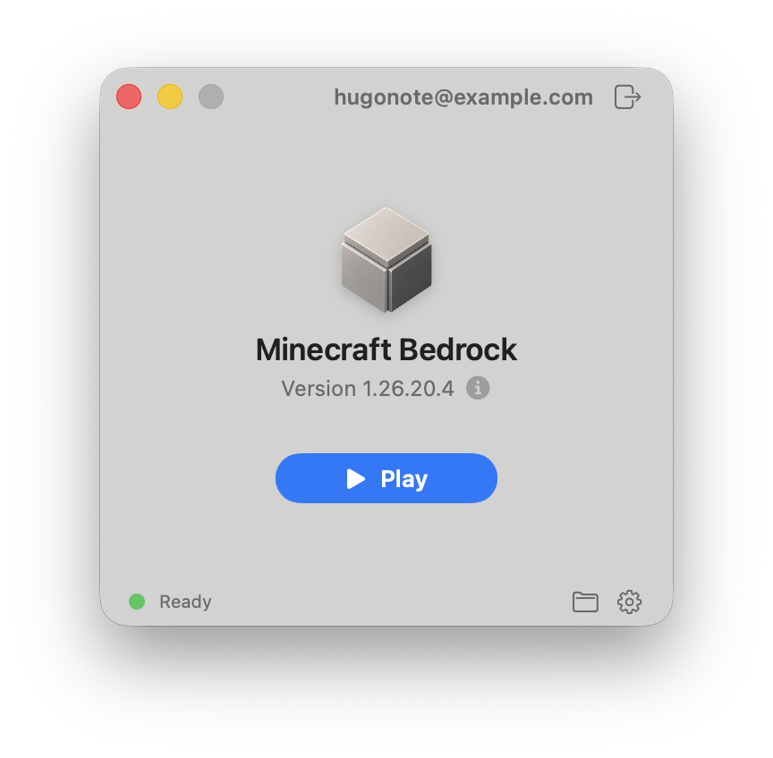

<p align="center">
  <a href="https://github.com/hugonote/mcpelauncher-swift/releases/latest"></a>
  
  
  <a href="LICENSE"></a>
</p>

<h1 align="center">Minecraft Bedrock Launcher</h1>

<p align="center">
  Native SwiftUI launcher for Minecraft: Bedrock Edition on macOS.
</p>

<p align="center">
  
</p>

## Overview

Minecraft Bedrock Launcher is an unofficial Swift and SwiftUI app for running
Minecraft: Bedrock Edition on macOS through the
[`mcpelauncher`](https://github.com/minecraft-linux/mcpelauncher-manifest)
runtime.

macOS 14 or newer and Apple Silicon are required.

## Installation

### GitHub Releases

Download the latest DMG from
[GitHub Releases](https://github.com/hugonote/mcpelauncher-swift/releases/latest).

### 🍺 Homebrew

```sh
brew tap hugonote/mcpelauncher-swift
brew install --cask minecraft-bedrock-launcher
```

> [!WARNING]
> Release builds are not notarized. If macOS blocks the app, open System
> Settings, go to Privacy & Security, scroll down, and allow
> `Minecraft Bedrock Launcher` from there. You only need to do this once.

## Features

- Native SwiftUI launcher window for macOS.
- Google Play sign-in through WebKit.
- Store Google Play credentials in the macOS Keychain.
- Version lookup and APK/split APK download through native Swift Google Play/Finsky code.
- Runtime download/update and compatibility patch setup.

The launcher code is MIT licensed. Upstream components keep their own licenses.

## Build

Requirements:

- macOS 14 or newer
- Apple Silicon Mac for release builds
- Swift 6 toolchain
- Xcode with `actool` for app icon compilation

Run tests:

```sh
swift test
```

Build the release `.app` bundle:

```sh
Scripts/build-app-bundle.sh
```

Build the release DMG:

```sh
Scripts/build-dmg.sh
```

The bundle script builds the launcher, helper executables, Sparkle framework,
and app resources.

If you want to build the Swift products manually:

```sh
swift build -c release --product MinecraftBedrockLauncher
swift build -c release --product mcpelauncher-ui-qt
swift build -c release --product mcpelauncher-webview
```

Useful release-time variables:

- `APP_VERSION=0.1.0`
- `CODESIGN_IDENTITY="Developer ID Application: ..."`
- `SPARKLE_FEED_URL=https://.../appcast.xml`
- `SPARKLE_PUBLIC_ED_KEY=...`
- `NOTARY_PROFILE=...`

## Credits

- Runtime: [`minecraft-linux/mcpelauncher-manifest`](https://github.com/minecraft-linux/mcpelauncher-manifest), GPL-3.0
- Compatibility patches: [`minecraft-linux/mcpelauncher-moddb`](https://github.com/minecraft-linux/mcpelauncher-moddb)
- Google Play/Finsky client: [`FinskyKit`](https://github.com/hugonote/FinskyKit), MIT
- Updates: [`Sparkle`](https://github.com/sparkle-project/Sparkle), MIT-style license

Minecraft Bedrock Launcher is not affiliated with Mojang, Microsoft, Google, or
the `minecraft-linux` maintainers.
